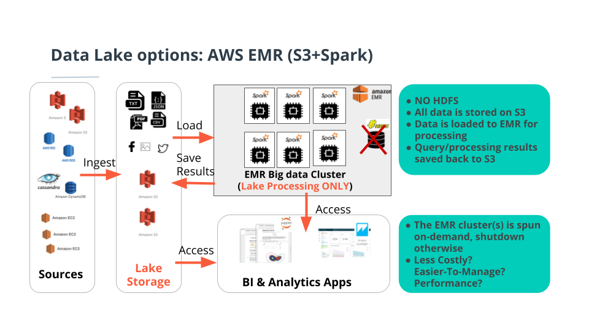

# SPARKIFY Data Lake (Amazon S3 - AWS EMR)

## Table of Contents

- [SPARKIFY Data Lake (Amazon S3 - AWS EMR)](#sparkify-data-lake-amazon-s3---aws-emr)
  - [Table of Contents](#table-of-contents)
  - [Introduction](#introduction)
  - [Tools](#tools)
  - [Schema](#schema)
    - [Fact Table](#fact-table)
    - [Dimension Tables](#dimension-tables)
  - [Project Dataset](#project-dataset)
    - [Song Dataset](#song-dataset)
    - [Log Dataset](#log-dataset)
  - [Data Pipeline](#data-pipeline)
  - [Project Files](#project-files)

## Introduction

A music streaming startup, **Sparkify**, has grown their user base and song database even more and want to move their data warehouse to a data lake. Their data resides in S3, in a directory of JSON logs on user activity on the app, as well as a directory with JSON metadata on the songs in their app.

As their data engineer, I had to build building an ETL pipeline that extracts their data from **S3**, processes them using **Spark**, and loads the data back into **S3** as a set of dimensional tables in **parquet** format. This will allow their analytics team to continue finding insights in what songs their users are listening to.

We'll deploy this Spark process on a cluster using AWS.

## Tools

<p style="float:left">


</p>
<div style="clear:both">

## Schema

Schema for Song Play Analysis

Using the song and log datasets, you'll need to create a star schema optimized for queries on song play analysis. This includes the following tables:-


### Fact Table

**_songplays_** - records in log data associated with song plays i.e. records with page NextSong
  - songplay_id, start_time, user_id, level, song_id, artist_id, session_id, location, user_agent

### Dimension Tables
**_users_** - users in the app
  - user_id, first_name, last_name, gender, level

**_songs_** - songs in music database
  - song_id, title, artist_id, year, duration

**_artists_** - artists in music database
  - artist_id, name, location, lattitude, longitude

**_time_** - timestamps of records in songplays broken down into specific units
  - start_time, hour, day, week, month, year, weekday

## Project Dataset

- `Song data: s3://udacity-dend/song_data`
- `Log data: s3://udacity-dend/log_data`

### Song Dataset

The first dataset is a subset of real data from the [Million Song Dataset](http://millionsongdataset.com/). Each file is in JSON format and contains metadata about a song and the artist of that song.

The files are partitioned by the first three letters of each song's track ID. For example, here are filepaths to two files in this dataset.

```python
song_data/A/B/C/TRABCEI128F424C983.json
song_data/A/A/B/TRAABJL12903CDCF1A.json
```

And below is an example of what a single song file, `TRAABJL12903CDCF1A.json`, looks like.

```json
{"num_songs": 1,
 "artist_id": "ARJIE2Y1187B994AB7", 
 "artist_latitude": null, 
 "artist_longitude": null,
 "artist_location": "", 
 "artist_name": "Line Renaud", 
 "song_id": "SOUPIRU12A6D4FA1E1", 
 "title": "Der Kleine Dompfaff", 
 "duration": 152.92036, 
 "year": 0
 }
```

### Log Dataset

The second dataset consists of log files in JSON format generated by this [event simulator](https://github.com/Interana/eventsim) based on the songs in the dataset above. These simulate app activity logs from an imaginary music streaming app based on configuration settings.

The log files in the dataset are partitioned by year and month. For example, here are filepaths to two files in this dataset.

```python
log_data/2018/11/2018-11-12-events.json
log_data/2018/11/2018-11-13-events.json
```

And below is an example of what the data in a log file, `2018-11-12-events.json`, looks like.


## Data Pipeline

I chose building a data lake using S3 and Spark in EMR Cluster as we see



- Loading data from S3 Bucket folders into the Spark EMR Cluster
- Processing data and transform it into the fact and the dimensions
- Storing the fact and dimensions as Parquet columnar storage files and partition them by the right columns
- Every Dimension will be stored in different folders in your created S3 bucket

## Project Files

- `dl.cfg` : Your AWS Credentials to connect to your IAM User in the account
- `etl.py` : Reads data from S3, processes that data using Spark, and writes them back to S3
- `etl.ipynb` : It is the same as `etl.py` but it is for testing locally or in your workspace
- `README.md` : Provides discussion on your process and decisions
